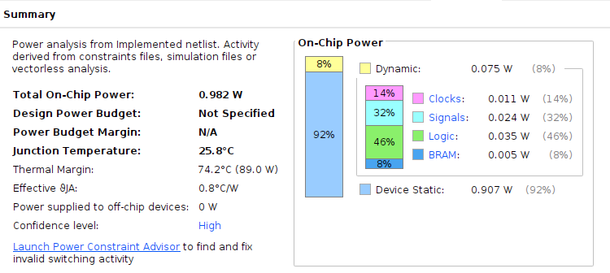

# updated ensemble HW design

This is the project I started after finishing the main ensemble spiking neural network implementation.

This project aims to optimise mainly the design of the analogue input layer so that the computation could be improved and save power sonsumption with less address switching.

In the meantime, this will only choose 5 nets from the SNN ensemble to save power.

## 3 Nov

Main idea of this project:

Old design loops through the time steps and within that loop it will loop through all the addresss again to yield the same membran voltage change to the neuron at the new time step.

This could be optimised with an expanded voltage memory to save the voltage from last time step and the voltage difference from the first time step.


Now I redesigned the first layers IF neuron to support both multiplication-accumulation and both simply accumulation.


Newly added ports to the neuron module are:
+ mem_vol_diff_2_be_add; 16-bit input acting as the difference of the voltage change
+ arithm;  1-bit input arithmatic selection, 0 as MAC, 1 as ACC. 
+ post_mem_vol_diff; 16-bit output of the voltage change at last time step


But in the meantime, this change once implemented, it will mean that the analogue input layer will act faster than the second layer in the second phase.

To keep the work minimised and the second layer design unchanged, I could either:
+ insert a FIFO
+ slow down the first layer at the second phase


I will slow down the first layer's process.


Another question to be considered is where should I save the voltage change.

According to the simulation, voltage change should be available the same time as the post_mem_vol.

I could make modification on the voltage_mem in the first layer and keep the second voltage mem unchanged.

I will redesign the voltage mem for the first layer with a new module where the width will be doubled and depth stays unchanged.

Each row of memory will be formatted like this:

32'h  AAAA_BBBB where AAAA will be the voltage change BBBB will be the initial voltage.


The newly designed sate machine should be something like this:

```python

for t in range(4):
	if t==0: ## t = 0
		w_i = 0
		for neuron_i in range(40): ## for each neuron
			load_voltage(0) ## load the raw voltage with arithm = 0
			N = load_offset() ## check how many computations it needs
			for i in range(w_i, w_i+N+1, 1):
				index, w = load_weight(i)
				act = load_act(index)
				compute(act, w)
			output_spk_dump_voltage()
			w_i += N
	else:
		for neuron_i in range(40):
			load_voltage(1) ## load the processed voltage with arithm = 1 
			compute(pre_vol, vol_diff)
			output_spk_dump_voltage()

```

## 4 Nov

The newly designed state machine chart should probably look like this:


The blue part belongs to the old controller state machine, the crimson part is the extra logic I need to add to the state machine.

The only extra port I need to add is simply just the arithm port to the neuron.

Finished the main design and did the simulation. 

So far the functionality looks alright, but the computation looks wrong.

Will verify this tomorrow.


## 6 Nov

Since the state machine has already been setup, I will check the behaviour now.

I will first check the simulation of the old version of the simulation and see the activation for this specific sample.

Just reran the simulation and collected the key data from the simulation, will compare them against the new simulation.

It turns out that I forgot to declare the weight_out_mem as an 8-bit wire so that it was treated as a 1 bit wire.

After fixing this bug, this layer is now giving correct spike AER.


I should check how fast could the second stage be in terms of the spike so that the following layer could catch up.

This would only leave the second layer 6 clock cycles to deal with the spike.

Example simulation shows that it needs:

37, cycles 31 cycles.

These two numbers correspond to the processing unit of 6 and 5.

The clock cycles it needs is 6\*n+2 (one extra cycle for the complete display of the valid signal)

But this would totally depends on how many neurons this spike will trigger.

Normally one spike will trigger 0.3\*18 neurons that is 5.4 neurons.

What I could do probably is to check the distribution of the numbers of neurons triggered by spikes for each spike from the hidden layer.

After checking on the distribution of the count of each possible bin, it could be seen that the possible connection ranges from 1 to 12, so I should at least leave 12 connections for the possible computation.

that is at least 12\*6 +2 = 74 cycles.


## 8 Nov

Will now change the design in the controller state machine to delay each cycle by 70 cycles since the spike generation would take at least 6 cycles if memory serves.

6 cycles confirmed for the spike generation process.
Now thinking which state I should extend for this.

Found that tidy_up state does nothing.

Just extended the tidy_up state if time_step_cnt != 0 for 70 cycles;

I has now been verified that cloeset spikes between each other would be 750 ns.

This should be enough for the second layer in the worst case.

#### updated spike generation simulation

Will now hook up the INF layer and verify the computation.

I see that I have been switching weight memory address like this:

0 -> neuron_index -> 0 -> neuron_index -> neuron_index+1 -> 0

wonder if this is necessary.

Will now simulate at the top level of the updated spike generation module,

Simulation on the spike generation module looks ok so far, will not hook up the next layer to see if the simulation shows what I want.

#### spike_gen +INF layer simulation

Think it works with the second layer hooked and giving the correct inference of 13.

#### updated bin_ratio_net simulation

Now I am moving one layer above and build the whole net with pre-processing included.

Testing the net with real input values.

I see that diagonal 15 is giving me wrong results, but diagonal 0 works just fine.

#### ensemble net simulation

I will now move one level above again and simulate at the ensemble level.

Seems that a lot of nets are giving me 0 not sure what is happening with the ensemble, but I will check what is happening here.

Will now switch back the old spike generation top and see the results.

I realised that I have not parametraised the sub module in the updated spike_generation_top module.

Yes, after fixing this, the simulation on the bin_ratio_net_top_tb works when diagonal is set to 15.

Will check again on the bin_ratio_ensemble_top_tb.

Yes, this has fixed the issue with the ensemble net.

This proves to be working and requires even less time (just around 1/3 of the original latency)

And from simulation, it shows that the latency is just 333.185 us.

#### FPGA validation

I will leave this part to a later stage, but so far it looks promising.


#### Power analysis

Just reran the post-implementation simulation and found the results correct.

Now inserting the saif file into the analysis and see the power consumption.

I did drop the power consumption: 310 + 910 mW

Here is the new power breakdown:


The resource breakdown is here:


Even though the spike generation is still the most power consuming part in the hierarchy, but it has dropped at least 2 mW each net. 

Now the biggest net will consume 18 mW.

Another thing that needs attention is there is a concerning warning about my design.

```text
[Synth 8-7137] Register voltage_diff_reg in module acc_encapsule_IF has both Set and reset with same priority. This may cause simulation mismatches. Consider rewriting code  ["/home/sx4n18/ensemble_spiking/Ensemble_SNN_updated/HW/acc_IF_neuron.sv":42]
```

I should probably rewrite the code and do the simulation and synthesis again.


## 9 Nov

I will log down the artix board I used previously for the "just-exact-amount-of-resources" implementation.

The part number is xc7a100tcsg324-3

I noticed that request_this_dia bus are not all connected during post-imp simulation, and it seems some diagonals were ommitted during synthesis.

Probably because it does not change the whole logic even when removed.


## 15 Nov

Back from the trip, now I am feeling more charged with ideas and confidence to finish my PhD.

To save power from the state machine, I will optimise the system from just point of view of a single bin_ratio_net.

Think most of the power consumption comes from the internal register (counter) flipping.

This is not something I could probably optimise, but I could try to find the best combo of bin-ratio-net with probably just 5 nets.

This should be enough.

But I fixed one synthesis warning about the register voltage_diff.


## 20 Nov

Now rerun the implementation and run the syntehsis to get the updated figures again.

The newest figure of the power consumption has been decreased to 

305 mW + 910 mW 


The power hierarchy:


I could now recalculate the key figures in the paper.

The updated design has the following resource usage:

| Resource    | utilisation | Available | util % |
| ----------- | ----------- | --------- | ------ |
| LUT         | 61822       | 537600    | 11.5   |
| LUTRAM      | 1050        | 76800     | 1.37   |
| FF          | 9841        | 1075200   | 0.92   |
| BRAM        | 10          | 1728      | 0.58   |

The latency is 334 us or 0.334 ms, this gives the throughput of 2.994e3 if/s

If we use the same assumption with 12% of the static power.

The estimated total power is:

305 mW + 110 mW = 415 mW

The new power efficiency is:

$$\frac{2.994\times 10^{3}}{415} = 7.214 if/(s \cdot mW)$$

Each inference burns 139 $\mu J$

each inferenrece will do operations:

first layer:

first time step:

$$(1023 + 1022 + 1021+.....+1004)\times 40\times 0.3 = 243240$$

next 3 steps:

$$40 \times 3 = 120$$

subtotal:

$$243240 + 120 = 243360$$

second layer:
(according to the previous estimation)

$$4090\times 4 = 16360$$ 

Two layers in total:

$$243360 + 16360 = 259720$$

This gives the operations per second:

$$259720 \div (334 \times 10^{-6}) = 7.78\times 10^{8} OP/s$$

or 778 MOP/s

energy efficiency with operation is:

$$778 \div 415 = 1.87 MOP/(s \cdot mW)$$


## 15 Dec

Have been thinking about the last trimming optimisation.

I could probably use bayesian optimisation to get a general trend first and then decide exactly how many nets I need.

And then do an exhaustive search on the net combination to get the highest accuracy.

Now learning how to use bayesian optimisation.

I keep forgeting my last script to validate the converted SNN.

It should be on branch **rey**, and the script is: TF_imp_rey/LSQ_training_on_pruned_ensemble.py.

Just turn the option **Training_from_scratch** off and it will start to read the weight and get to the validation stage.

I should probably draft a new script specifically for my Bayesian optimisation.


## 25 Dec

I asked ChatGPT to generate code for me to pick 5 nets out of 20 using bayesian optimisation.

After some iteration, here is the python code:

```python

import numpy as np
from sklearn.metrics import accuracy_score
from skopt import gp_minimize

# Assuming you have inference results from 20 nets (replace this with your actual data)
# shape: (1350, 20, 18)
inference_results = np.random.rand(1350, 20, 18)

# Corresponding labels (replace this with your actual labels)
labels = np.random.randint(0, 18, size=(1350,))

# Define the objective function to maximize accuracy
def objective(indices):
    # Ensure exactly 5 nets are selected
    if np.sum(indices) != 5:
        return 0.0  # Penalize configurations that don't satisfy the constraint
    
    ensemble_predictions = np.mean(inference_results[:, indices, :], axis=1)
    ensemble_predictions = np.argmax(ensemble_predictions, axis=1)
    
    accuracy = accuracy_score(labels, ensemble_predictions)
    
    return -accuracy  # Minimize, so negate the accuracy

# Define the search space to select exactly 5 nets out of 20
space = [(0, 1) for _ in range(20)]

# Gaussian process-based Bayesian optimization without explicit constraints
result = gp_minimize(
    objective,
    space,
    n_calls=100,
    n_random_starts=10,
    acq_func='EI',
    random_state=42,
)

# Extract the best combination of indices
best_indices = np.round(result.x)
selected_indices = [i for i, val in enumerate(best_indices) if val == 1]

print("Best combination of indices:", selected_indices)

```

Since gp_minimise is trying to minimise the objective, I asked gpt to rewrite the objective function so that it will minimise the cross entropy between label and prediction.

```python
import numpy as np
from sklearn.metrics import log_loss
from skopt import gp_minimize

# Assuming you have inference results from 20 nets (replace this with your actual data)
# shape: (1350, 20, 18)
inference_results = np.random.rand(1350, 20, 18)

# Corresponding labels (replace this with your actual labels)
labels = np.random.randint(0, 18, size=(1350,))

# Define the objective function to minimize cross-entropy
def objective(indices):
    # Ensure exactly 5 nets are selected
    if np.sum(indices) != 5:
        return 10.0  # Penalize configurations that don't satisfy the constraint
    
    ensemble_predictions = np.mean(inference_results[:, indices, :], axis=1)
    ensemble_predictions = np.argmax(ensemble_predictions, axis=1)
    
    ce = log_loss(labels, ensemble_predictions, labels=np.arange(18))
    
    return ce  # Minimize cross-entropy

# Define the search space to select exactly 5 nets out of 20
space = [(0, 1) for _ in range(20)]

# Gaussian process-based Bayesian optimization without explicit constraints
result = gp_minimize(
    objective,
    space,
    n_calls=100,
    n_random_starts=10,
    acq_func='EI',
    random_state=42,
)

# Extract the best combination of indices
best_indices = np.round(result.x)
selected_indices = [i for i, val in enumerate(best_indices) if val == 1]

print("Best combination of indices:", selected_indices)
```
Found that my code has commented off the line that saves the testing results and hard_voting results, will temporarily turn this back on and save the results somewhere.

Also I realised that exhaustive search for the combination of 5 out of 20 is not too expensive.

only 15,504 combinations, totally searchable

The exhaustive search gives me the accuracy of 96.74%, which is not bad.

```text
The best accuracy is  0.9674074074074074
The best index is  5932
The best combination is  (1, 5, 16, 17, 19)
```

## 3 Jan

Following the test, I will now update the hardware design and do another power measurement.


Since I now have the best combo of 5 (1,5,16,17,19), I will now update the hardware design to just have these 5 nets.


I realised that I have a lot of different projects in my laptop.

The newest and updated one is in the folder 

```
~/ensemble_spiking/Ensemble_SNN_updated_vivado_sim/ensemble_SNN_update

```

Will now add another top module and rerun the implementation to get a new updated power measurement.


Have just modified the very top module namely Trimmed_bin_ratio_ensemble_spiking_net

With each net mannually instantiated.

```text
"[Synth 8-3848] Net final_judgement in module/entity Trimmed_bin_ratio_ensemble_spiking_net does not have driver. ["/home/sx4n18/ensemble_spiking/Ensemble_SNN_updated/HW/Trimmed_bin_ratio_ensemble_spiking_net.v":37]
"
```

Found this message, and then I realised that I did not connect the infer_ready_this_dia signal to the register for saving.


I will do a simulation now before running synthesis.

Remember that the settings needed to generate the saif file:


The simulation shows that the 5 nets' design is functional and working:


New trimmed design utilisation:

The updated design has the following resource usage:

| Resource    | utilisation | Available | util % |
| ----------- | ----------- | --------- | ------ |
| LUT         | 15337       | 537600    | 2.85   |
| LUTRAM      | 260         | 76800     | 0.34   |
| FF          | 2543        | 1075200   | 0.24   |
| BRAM        | 2.5         | 1728      | 0.14   |

There is a significant resource saving from previous design. with now under 3% resource usage.

Will now run the simulation and generate the SAIF file for power analysis.

Latency did not change for this design, which is still 334 us or 0.334ms, that is 2.994e3 if/s.


The new power breakdown for the trimmed design is:




It could be seen that dynamic power only costs 75 mW and the static power is still really high at around 907 mW

If we use the same assumption with 4% of the static power.

The estimated total power is:

75 mW + 36 mW = 111 mW

The new power efficiency is:

$$\frac{2.994\times 10^{3}}{111} = 26.973 if/(s \cdot mW)$$

Each inference burns 37.1 $\mu J$

Since we only have nets 1, 5, 16, 17, 19

each inferenrece will do operations:

first layer:

first time step:

$$(1022 + 1018 + 1007 + 1006 +1004)\times 40\times 0.3 = 60,684$$

next 3 steps:

$$40 \times 3 = 120$$

subtotal:

$$60,684 + 120 = 60,804$$

second layer:
(according to the previous estimation)

Since 4090 is for 20 nets, for only 5 nets, it would be 1022.5 

$$1022.5\times 4 = 4090$$ 

Two layers in total:

$$60,804 + 4,090 = 64,894$$

This gives the operations per second:

$$64,894 \div (334 \times 10^{-6}) = 1.94\times 10^{8} OP/s$$

or 194 MOP/s

energy efficiency with operation is:

$$194 \div 111 = 1.75 MOP/(s \cdot mW)$$


Since the resource usage is really low, I could probably use a low-end FPGA for the samet test and compare to make sure my assumption can stand.


## 22 Feb

I will organise the project files for Vivado today and see what I have done.


### Project kintex_bin_ratio_pwr

Location: /home/sx4n18/FPGA_projects/bin_ratio_ensemble_pwr/artix_bin_ratio_pwr

Product family: Artix-7

Project part: xc7a100tcsg324-3

Purpose of the project: Power measurement

Top module: Bin_ratio_ensemble_spiking_net

Ensemble design version: v0.1

Ensemble size: 20

SAIF file: Present

Power analysis: 517 + 94 mW

Resource usage:

| Item        | Available   |  Used   |  Utilisation rate %|
| ----------- | ----------- | --------| ----------------   |
| LUT         | 63400       |  59476  | 93.81072           |
| LUTRAM      | 19000       | 715     | 3.7631578          |
| FF          | 126800      | 8008    | 6.315457           |
| BRAM        | 135         | 20      | 14.814815          |
| IO          | 210         | 30      | 14.285715          |


Comment:
The tool will complain the synthesis is out of date, because input_value_mem.v was modified.

I guess the modified part was the comment-off-ed part was released for a quick test.

Suggest not to update the sysnthesis and implementation.


### Project pwr_measure

Location: /home/sx4n18/FPGA_projects/bin_ratio_ensemble_pwr/pwr_measure

Product family: Virtex UltraScale

Project part: Virtex-UltraScale VCU108 Evaluation Platform (xcvu095-ffva2104-2-e)

Purpose of the project: Power measurement

Top module: Bin_ratio_ensemble_spiking_net

Ensemble design version: v0.1

Ensemble size: 20

SAIF file: present

Power analysis: 396 + 911 mW

Resource usage:

| Item        | Available   |  Used   |  Utilisation rate %|
| ----------- | ----------- | --------| ----------------   |
| LUT         | 537600      |  60291  | 11.214844          |
| LUTRAM      | 76800       | 730     | 0.9505209          |
| FF          | 1075200     | 8678    | 0.80710566         |
| BRAM        | 1728        | 10      | 0.5787037         |


### Project ensemble_spiking_net

Location: /home/sx4n18/ensemble_spiking/Ensemble_SNN_HW/vivado_sim/ensemble_spiking_net

Product family: Virtex UltraScale

Project part: Virtex-UltraScale VCU108 Evaluation Platform (xcvu095-ffva2104-2-e)

Purpose of the project: Design validation

Top module: top_ensemble_testing

Ensemble design version: v0.1

Ensemble size: 20

SAIF file: absent

Power analysis: 480 + 912 mW (medium confidence estimation)

Resource usage:

| Item        | Available   |  Used   |  Utilisation rate %|
| ----------- | ----------- | --------| ----------------   |
| LUT         | 537600      |  61134  | 11.371652          |
| LUTRAM      | 76800       | 1066    | 1.3880208          |
| FF          | 1075200     | 8868    | 0.82477677         |
| BRAM        | 1728        | 10      | 0.5787037         |
| IO          | 832         | 10      | 1.2019231         |
| MMCM        | 16          | 1      | 6.25         |
| BUFG        | 960         | 1      | 0.10416667         |


Comment:

From the look of the project, the accuracy must have been validated with the FPGA implementation.

Hardware implementation should be consistent with the software simulation.

It also complains the out-of-date synthesis, it is due to the same modification made on input_value_mem.v


### Project ensemble_SNN_update

Location: /home/sx4n18/ensemble_spiking/Ensemble_SNN_updated/vivado_sim/ensemble_SNN_update

Product family: Virtex UltraScale

Project part: Virtex-UltraScale VCU108 Evaluation Platform (xcvu095-ffva2104-2-e)

Purpose of the project: Power measurement

Top module: Trimmed_bin_ratio_ensemble_spiking_net

Ensemble design version: v0.2

Ensemble size: 5

SAIF file: present (Trimmed_switch.saif and updated_switch.saif)

Power analysis: 75 + 907 mW 

Resource usage:

| Item        | Available   |  Used   |  Utilisation rate %|
| ----------- | ----------- | --------| ----------------   |
| LUT         | 537600      |  15337  | 2.8528645          |
| LUTRAM      | 76800       | 260    | 0.33854166          |
| FF          | 1075200     | 2543    | 0.23651414         |
| BRAM        | 1728        | 2.5      | 0.14467593         |


Comment:

Think this is my newest project with the trimmed ensemble and power measurement.

There are two SAIF files because one is for the trimmed ensemble, one is for the whole ensemble.

The implementation in this project is in agreement with the trimmed version.


### Project kintex_pwr_measure

Location: /home/sx4n18/FPGA_projects/bin_ratio_ensemble_pwr_kintex/kintex_pwr_measure

Product family: Kintex UltraScale

Project part: xcku025-ffva1156-1-c

Purpose of the project: Power measurement

Top module: Bin_ratio_ensemble_spiking_net

Ensemble design version: v0.1

Ensemble size: 20

SAIF file: present

Power analysis: 388 + 481 mW 

Resource usage:

| Item        | Available   |  Used   |  Utilisation rate %|
| ----------- | ----------- | --------| ----------------   |
| LUT         | 145440      |  60289  | 41.452835          |
| LUTRAM      | 67680       | 730    | 1.0786052          |
| FF          | 290880     | 8678    | 2.983361         |
| BRAM        | 360        | 10      | 2.777778         |


## 23 Feb

Just realised that I have conducted an exhaustive search on full precision prediction ensemble instead of the quantised ensemble.

Now I have saved the quantised ensemble prediction and did the exhaustive search again, it is giving me different combo for an even higher accuracy this time.


```text
The best accuracy is  0.9681481481481482
The best index is  13948
The best combination is  (6, 9, 11, 17, 18)
```

Contrary to the previous index, the combo of (6,9,11,17,18) is giving 96.81\% instead of 96.74\%.

I shall update the hardware again after.

Now I should have a confusion matrix for 8-bit implementation.

This has been generated and included in my thesis.


On the side note, I should also probably consider carrying out the exhaustive search on the combination of ensemble SNN for the final accuracy.

So far the target range starts from 1 to 10.

The thorough exhaustive search for this range has been finished:


## 24 Feb

Should I also run exhaustive search for range from 11 to 20?

I mean, I could...

But I really need to save the accuracy along the ensemble size.

Ok, now I have run all the exhaustive search for size from 1 to 20.

Box plot is here:


### OK, now I should switch to FPGA implementation run on Vivado and get some more data!


About the power saving technique I found that I can probably turn the power_opt_design on to do either pre-synth power optimisation or post-imp optimisation but not both.

This is basically achieved by clock gating and power gating.

Clock gating basically will include some extra LUT to disable clock when unnecessary.

Power gating can blockout the unsued BRAM so that it will not consume more power.


Now I should rerun some design implementation and turn this on to see how it does.


### Project Virtex_ultrascale_VCU108 (not set for OOC)

Location: /home/sx4n18/FPGA_projects/various_boards_imp/virtex_ultrascale/VCU108/Virtex_ultrascale_VCU108

Product family: Virtex UltraScale

Project part: Virtex-UltraScale VCU108 Evaluation Platform (xcvu095-ffva2104-2-e)

Purpose of the project: Power measurement

Top module: Bin_ratio_ensemble_spiking_net

Ensemble design version: v0.2

Ensemble size: 20

SAIF file: present

Power analysis: 322 + 910 mW 

Resource usage: 


| Item        | Available   |  Used   |  Utilisation rate %|
| ----------- | ----------- | --------| ----------------   |
| LUT         | 537600      |   62086 |    11.548736       |
| LUTRAM      | 76800       |    1050 |      1.3671875     |
| FF          | 1075200     |  9841   |     0.9152716     |
| BRAM        | 1728        |   10    |     0.5787037     |
| IO          | 832         | 30      |     3.6057692     |
| BUFG        | 960         | 1       | 0.10416667        |

Comment:

This is the first attempt for using power_opt_design for introducing clock enable or power gating.

But not sure if it is because I did not turn on out of context synthesis or anything, the power is not saved but even higher than the old one that does not have clock enable.

Probably it is the additional resouce usage that is taking more power, because this implementation has higher LUT use and additional IO and BUFG use.

Will turn opwer opt design off for now.


### Project Artix-7

Location: /home/sx4n18/FPGA_projects/various_boards_imp/artix_board_imp/Artix_7

Product family: Artix-7 Low Voltage

Project part: xc7a100tlcsg324-2L

Purpose of the project: Power measurement

Top module: Bin_ratio_ensemble_spiking_net

Ensemble design version: v0.2

Ensemble size: 20

SAIF file: failed

Power analysis: 

Resource usage: 


| Item        | Available   |  Used   |  Utilisation rate %|
| ----------- | ----------- | --------| ----------------   |
| LUT         | 63400       |   66215 |    104.440056      |
| LUTRAM      | 19000       |    4186 |      22.031578    |
| FF          | 126800     |  9117   |     7.190063     |
| BRAM        | 135        |   11    |     8.148148     |


Comment:

The purpose of this project is to try out the artix-7 lower voltage family to see if it actually saves power.

But this implementation cannot be run because the LUT was over used by 4 \%.

Not sure if it is because it is low voltage, so it needs more resource, I will now switch back to the board I have tried before for the next implementation.


### Project Artix_7_higher_speed

Location: /home/sx4n18/FPGA_projects/various_boards_imp/artix_board_imp/Artix_7_higher_speed

Product family: Artix-7

Project part: xc7a100tcsg324-3

Purpose of the project: Power measurement

Top module: Bin_ratio_ensemble_spiking_net

Ensemble design version: v0.2

Ensemble size: 20

SAIF file: present

Power analysis:  386 + 86 mW 

Resource usage: 

| Item        | Available   |  Used   |  Utilisation rate %|
| ----------- | ----------- | --------| ----------------   |
| LUT         | 63400       |   60392 |    95.255516      |
| LUTRAM      | 19000       |    715 |      3.7631578    |
| FF          | 126800     |  8837   |     6.9692426     |
| BRAM        | 135        |   20    |     14.814815     |

Comment:

This is my second time using this board for implementation, last time it was my first version of hardware implementation, the dynamic power was up to 517 mW.

This seems like a dramatic reduction for power.


### Project Spartan_7

Location: /home/sx4n18/FPGA_projects/various_boards_imp/spartan_board

Product family: Spartan-7

Project part: xc7s100fgga484-2

Purpose of the project: Power measurement

Top module: Bin_ratio_ensemble_spiking_net

Ensemble design version: v0.2

Ensemble size: 20

SAIF file: present

Power analysis:  393 + 92 mW 

Resource usage: 

| Item        | Available   |  Used   |  Utilisation rate %|
| ----------- | ----------- | --------| ----------------   |
| LUT         | 64000       |   60369 |    94.32656      |
| LUTRAM      | 17600       |    715 |      4.0625    |
| FF          | 128000     |  8837   |     6.9039063    |
| BRAM        | 120        |   20    |     16.666668     |


Comment:

This is an attempt to use Spartan-7 as the target FPGA for the implementation.

This shows that the power can be minimised to around this level.


### Project smallest_virtex_ultrascale

Location: /home/sx4n18/FPGA_projects/various_boards_imp/virtex_ultrascale/AnotherVirtex_ultrascale

Product familty: Virtex UltraScale

Top module: Bin_ratio_ensemble_spiking_net

Ensemble design version: v0.2

Ensemble size: 20

I failed, because apparently, you need a license for this board.


### Project Kintex_ultrascale

Location: /home/sx4n18/FPGA_projects/various_boards_imp/kintex_ultrascale

Product familty: Virtex UltraScale

Project part: xcku025-ffva1156-1-c

Top module: Bin_ratio_ensemble_spiking_net

Ensemble design version: v0.2

Ensemble size: 20

SAIF file: present

Power analysis:  298 + 480 mW 

Resource usage: 

| Item        | Available   |  Used   |  Utilisation rate %|
| ----------- | ----------- | --------| ----------------   |
| LUT         | 145440      |   61839 |    42.518566      |
| LUTRAM      | 67680       |    1050 |      1.5514184    |
| FF          | 290880     |  9841   |     3.383182    |
| BRAM        | 360        |   10    |     2.777778    |


Comment:

Somehow this has an even smaller power consumption than Virtex? not sure why

Also I forgot to turn on ooc synthesis for Project Virtex_ultrascale_VCU108, so I will run it again with the OOC turned on.


### Project Virtex_ultrascale_VCU108 (OOC on)

Location: /home/sx4n18/FPGA_projects/various_boards_imp/virtex_ultrascale/VCU108/Virtex_ultrascale_VCU108

Product family: Virtex UltraScale

Project part: Virtex-UltraScale VCU108 Evaluation Platform (xcvu095-ffva2104-2-e)

Purpose of the project: Power measurement

Top module: Bin_ratio_ensemble_spiking_net

Ensemble design version: v0.2

Ensemble size: 20

SAIF file: present

Power analysis: 308 + 910 mW 

Resource usage: 


| Item        | Available   |  Used   |  Utilisation rate %|
| ----------- | ----------- | --------| ----------------   |
| LUT         | 537600      |   61812 |    11.497768       |
| LUTRAM      | 76800       |    1050 |      1.3671875     |
| FF          | 1075200     |  9841   |     0.9152716     |
| BRAM        | 1728        |   10    |     0.5787037     |


Comment:

Apparently OOC synthesis will not generate IO and BUFG, this power consumption is within my expectation, cus last time it was 305 mW.

It can be seen that overall Kintex power consumption will be lower than Virtex.


Now I should back up all these projects.


